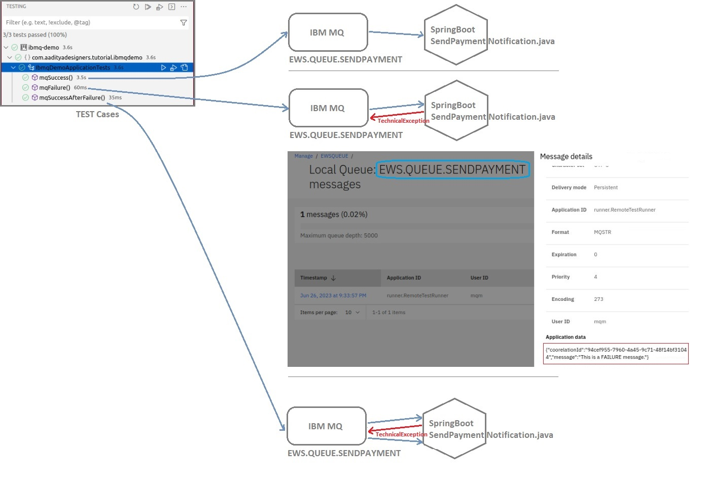

# IBM MQ (Docker Setup: mq-setup)
```sh
$ docker ps -aq | xargs docker stop | xargs docker rm
#$ docker pull icr.io/ibm-messaging/mq:latest

$ docker build -t zelle-mq-local .
$ docker volume create mqdata1
$ docker run --env LICENSE=accept --env MQ_QMGR_NAME=EWSQUEUE --volume mqdata1:/mnt/mqm --publish 1414:1414 --publish 9443:9443 --detach --env MQ_APP_PASSWORD=apple@26j --name mqcontainer1 zelle-mq-local

```
> Access IBM MQ Dashboard  
> https://localhost:9443/ibmmq/console/  
> Username: admin  
> Passowrd: passw0rd  
>
<br/>
<br/>  

# Application
The below diagram shows the scenarios under which IBM MQ succesfully processes messages and in case of failure (from the client application side) it retries it until all the messages are consumed.
> In case retry is not successfull (due to client application issue), then the messages are moved to the DEAD_LETTER_QUEUE from where the messages can be replayed using some scheduler.
<br/>
  
